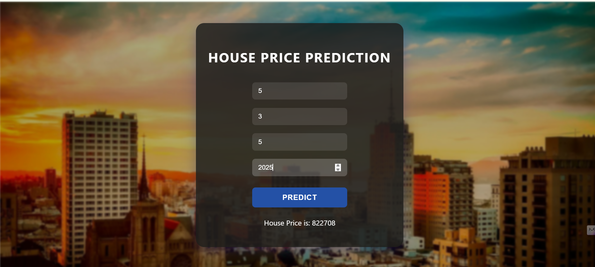

# House Price Prediction Web App

This project is a web application that predicts house prices using a machine learning model trained on real estate data. The app is built with Flask and provides a simple, user-friendly interface for entering house features and viewing predicted prices.

## Features

- Predict house prices based on user input
- Clean and responsive web interface
- Built with Python, Flask, and scikit-learn
- Easy to customize and extend

## Installation

1. Clone this repository:
    ```
    git clone https://github.com/yourusername/your-repo.git
    cd your-repo
    ```

2. Install the required packages:
    ```
    pip install -r requirement.txt
    ```

## Usage

Start the Flask application:
```
python app.py
```
Open your browser and go to `http://127.0.0.1:5000/` to use the app.

## Project Structure

```
app.py                  # Main Flask app
house.py                # Helper functions for prediction
model.pkl               # Trained machine learning model
house_data.csv          # Dataset used for training
static/                 # Static files (CSS, images)
templates/              # HTML templates
requirement.txt         # Python dependencies
README.md               # Project documentation
LICENSE                 # License file
```

## Screenshots





## License

This project is licensed under the BSD 3-Clause License. See the [LICENSE](LICENSE) file for details.

---

**Created by Your Name**  
Contact: digvijaypatil9103@gmail.com